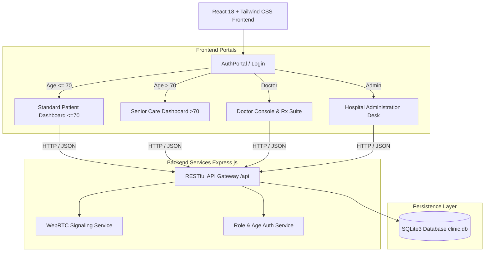

# 🏥 ClinicOS — Intelligent Healthcare Operating System & Telemedicine Network

[](https://react.dev/)
[](https://vitejs.dev/)
[](https://tailwindcss.com/)
[](https://expressjs.com/)
[](https://www.sqlite.org/)
[](https://webrtc.org/)
[](LICENSE)

---

## 🌟 Executive Summary

**ClinicOS** is an enterprise-grade, end-to-end **Hospital Information System (HIS)**, **Electronic Medical Record (EMR)**, and **Telehealth Suite**. Designed with a modern, glassmorphic UI and resilient full-stack architecture, it unifies patients, healthcare professionals, and administrative authorities into a single, cohesive clinical ecosystem.

ClinicOS introduces an **Age-Adaptive Patient Experience** that automatically personalizes interface complexity and accessibility based on the patient's age—delivering a streamlined, high-contrast, 1-touch senior interface for elders over 70, alongside a comprehensive clinical suite for standard patients.

---

## 🚀 Key Innovations & Features

### 🧑 1. Age-Adaptive Patient Experience
* **Age-Driven UI Personalization**: During login/registration, patients enter their age to dynamically load the appropriate dashboard:
  * **Standard Mode ($\le$ 70 Years)**: Comprehensive clinical portal with OPD booking across 16 specialties, at-home lab diagnostics, surgical care modules, EMR timeline, digital billing, and TPA insurance claims.
  * **Senior Care Mode ($>$ 70 Years)**: Simplified, high-accessibility interface tailored for older adults:
    * 🔴 **1-Touch 108 Emergency SOS**: Immediate ICU ambulance dispatch with live GPS tracking.
    * 📞 **1-Touch Primary Doctor Call**: Quick-connect video/audio consultation.
    * 👨‍👩‍👧 **1-Touch Family Caregiver Alert**: Instant dial to primary emergency contact.
    * 💊 **Daily Pill Checklist**: High-contrast, time-separated medication schedule (*Morning, Afternoon, Night*) with celebratory *“I Took This Pill”* actions.
    * 💓 **Oversized Vitals Monitor**: Plain-English health status for Blood Pressure, Heart Rate, Fasting Sugar, and SpO2.
    * 🔊 **Audio Read-Aloud Assistant**: Speaks daily appointments and medicine reminders aloud using Web Speech Synthesis.
    * 💧 **Hydration Tracker & Attendant Booking**: 1-tap water intake logger and doorstep nurse/attendant requests.

### 👨‍⚕️ 2. Doctor Clinical Console
* **Real-Time Patient Queue**: Daily consultation queue with status tracking (*Scheduled*, *In-Progress*, *Completed*).
* **EMR History & Timeline**: Longitudinal patient health record timeline with diagnoses, lab reports, and past visits.
* **Digital Prescription Creator (Rx)**: Multi-drug prescriber with dosages, frequencies, food timings, and ICD-10 diagnostic code tagging.
* **Telehealth Reception Suite**: Real-time WebRTC incoming call detection and video consultation room.

### 🏢 3. Hospital Administration & Operations
* **IPD Ward & Bed Occupancy**: Real-time bed availability and allocation tracking across *General*, *Semi-Private*, and *ICU* units.
* **160 Doctor & 16 Department Registry**: Departmental fee management and doctor directory with availability schedules.
* **108 Ambulance Fleet GPS Dispatch**: Real-time emergency ambulance dispatch with ETA calculation and driver telemetry.
* **Blood Bank Inventory**: Live stock tracking by blood group ($A^+, B^+, O^+, AB^+$, etc.).
* **TPA Insurance Approvals**: Claim lifecycle processing (*Under Review*, *Pre-Approved*, *Settled*).
* **System Audit & Security Logs**: Real-time audit trails capturing authentication events, role transitions, and prescription actions.

### 📹 4. WebRTC Telemedicine Suite
* Peer-to-peer audio/video streaming with screen sharing, in-call chat, and camera/mic controls.
* REST-polling & BroadcastChannel dual-signaling backend for seamless cross-tab and cross-device ringing.

---

## 🏛️ System Architecture



---

## 📂 Project Directory Structure

```
clinic-os/
├── server/                    # Node.js & Express REST Backend
│   ├── clinic.db              # SQLite Database file
│   ├── db.js                  # SQLite Promise Wrapper & Table Schema DDL
│   ├── index.js               # Express API Routes, Middleware & SPA Serving
│   └── seed.js                # Database Seeder (Doctors, Depts, Patients)
├── src/                       # React 18 Application Source
│   ├── components/
│   │   ├── admin/             # BedManagement, AmbulanceFleet, Invoices, AuditLogs
│   │   ├── auth/              # AuthPortal (Age-adaptive 3-role login & register)
│   │   ├── common/            # Shared UI modals, cards, badges
│   │   ├── doctor/            # DoctorConsole, EMRTimeline, CreatePrescriptionModal
│   │   ├── layout/            # Header, Sidebar, SOS Modal, Telehealth Alert
│   │   └── patient/           # Standard & Senior Care Dashboards, Meds, LabTests
│   │       ├── PatientDashboard.jsx        # Age-conditional dashboard router
│   │       ├── SeniorPatientDashboard.jsx  # Simplified Elder 70+ interface
│   │       ├── BookAppointmentModal.jsx    # Appointment booking engine
│   │       ├── TelemedicineCall.jsx        # WebRTC Video consultation
│   │       └── ...
│   ├── context/               # Global AppContext & State Handlers
│   ├── mockData/              # Seed constants & 160 generated doctors
│   ├── services/              # API Client (api.js)
│   ├── App.jsx                # Route Definitions (React Router v7)
│   ├── index.css              # Tailwind CSS 4 Theme & Animations
│   └── main.jsx               # Application Entrypoint
├── public/                    # Static Assets & Icons
├── Dockerfile                 # Multi-stage Containerization Build
├── render.yaml                # Render Infrastructure-as-Code Blueprint
├── vite.config.js             # Vite 5 Bundler Config
└── package.json               # Dependencies & NPM Scripts
```

---

## 🔌 API Reference

| Method | Endpoint | Description | Payload / Parameters |
| :--- | :--- | :--- | :--- |
| `POST` | `/api/auth/login` | Authenticate user with role & age | `{ email, password, role, age }` |
| `POST` | `/api/auth/register` | Register new account with role & age | `{ name, email, password, role, age, phone }` |
| `GET` | `/api/doctors` | Retrieve 160 doctors directory | — |
| `GET` | `/api/departments` | Retrieve 16 hospital clinical departments | — |
| `GET` | `/api/appointments` | List all patient appointments | — |
| `POST` | `/api/appointments` | Book new consultation | `{ patientId, doctorId, date, time, type }` |
| `GET` | `/api/prescriptions` | Retrieve digital prescriptions | — |
| `POST` | `/api/prescriptions` | Issue new prescription with ICD codes | `{ doctorId, patientId, medications, diagnosis }` |
| `GET` | `/api/vitals` | Fetch patient health vitals log | — |
| `POST` | `/api/vitals` | Log new vital measurements | `{ patientId, bpSystolic, bpDiastolic, heartRate, spo2 }` |
| `GET` | `/api/beds` | Retrieve IPD ward bed occupancy | — |
| `PATCH`| `/api/beds/:id` | Update bed assignment status | `{ status, patientId, patientName }` |
| `GET` | `/api/ambulance-fleet` | Retrieve 108 ambulance units | — |
| `GET` | `/api/blood-bank` | Retrieve blood unit inventory | — |
| `POST` | `/api/telehealth/call` | Initiate WebRTC consultation offer | `{ callerId, callerName, doctorId, offer }` |
| `POST` | `/api/telehealth/answer`| Respond with WebRTC session answer | `{ answer }` |
| `GET` | `/api/health` | Healthcheck monitor endpoint | — |

---

## 💻 Installation & Local Setup

### Prerequisites
* **Node.js**: v18.0.0 or higher ([Download](https://nodejs.org/))
* **npm**: v9.0.0 or higher

### 1. Clone the Repository
```bash
git clone https://github.com/shreyansh14-dev/clinic-os.git
cd clinic-os
```

### 2. Install Dependencies
```bash
npm install
```

### 3. Start Frontend Development Server
```bash
npm run dev
```
The application will be available at: **`http://localhost:5173/`**

### 4. Start Full-Stack Backend Server
To run the Express REST API with SQLite database persistence:
```bash
npm run server
```
The API server will listen on port **`5000`** (or `$PORT`).

---

## 🧪 Demo User Accounts

| Role | Email | Password | Age Behavior |
| :--- | :--- | :--- | :--- |
| **Patient ($\le$ 70)** | `patient@clinicos.com` | `patient123` | Enter Age `29` $\rightarrow$ Standard Clinical Dashboard |
| **Patient ($>$ 70)** | `patient@clinicos.com` | `patient123` | Enter Age `75` $\rightarrow$ Senior Care Dashboard |
| **Doctor** | `doctor@clinicos.com` | `doctor123` | Doctor Clinical Console & Digital Rx |
| **Hospital Admin** | `admin@clinicos.com` | `admin123` | Bed Management, 108 Fleet & Financial Ledger |

---

## 🐳 Docker Deployment

To build and run ClinicOS with Docker:

```bash
# Build the Docker image
docker build -t clinic-os .

# Run the container
docker run -p 5000:5000 clinic-os
```

Access the application in your browser at `http://localhost:5000`.

---

## ☁️ Cloud Deployment (Render)

ClinicOS is pre-configured for automated continuous deployment on [Render](https://render.com/) via the included `render.yaml` blueprint:

```yaml
services:
  - type: web
    name: clinic-os
    runtime: node
    plan: free
    buildCommand: npm install && npm run build
    startCommand: npm start
    healthCheckPath: /api/health
```

---

## 🛡️ Security & Compliance
* **Role-Based Access Control (RBAC)**: Distinct authorization boundaries for patients, physicians, and administrative staff.
* **Audit Logging**: Automatic timestamped audit logging for data access, diagnosis creation, and financial actions.
* **Data Integrity**: Foreign key constraints and transaction wrappers over SQLite.

---

## 📄 License
This project is licensed under the **MIT License** — see the [LICENSE](LICENSE) file for details.
